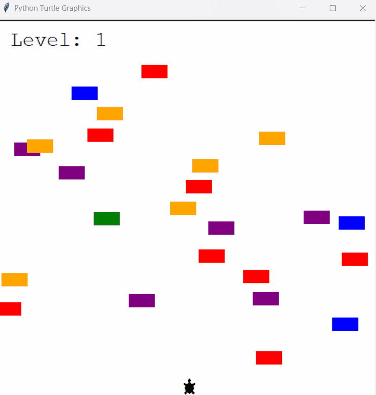

# Turtle-Crossing Game

## Turtle-Crossing Game built in Python with the Turtle library

<br>

> ### About the Game
>
> - The player controls the turtle with the "up" key.
> - The cars increase in speed with each level.
> - The game ends when a car crashes into the turtle.

<br>



<br><br><br>

## Setup

1. Clone this repository.
2. Run the following command in the terminal.

```sh
python main.py
```
